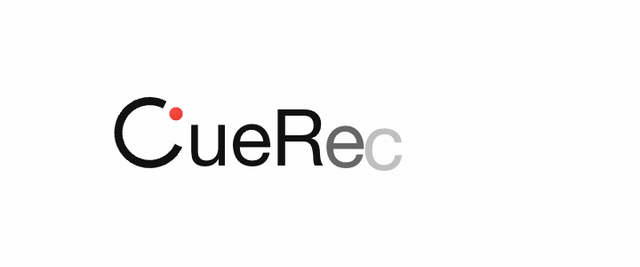
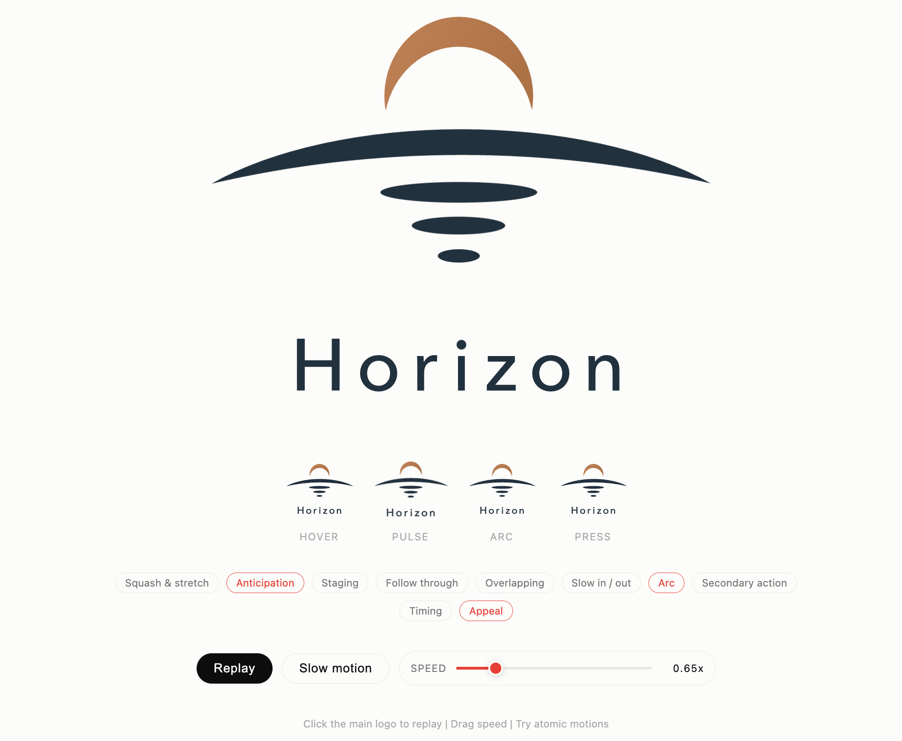

# Pixel2Motion

Raster logo -> smooth SVG -> choreographed HTML motion.

Pixel2Motion is a Codex skill for turning raster logos into clean, minimal vectors and then into branded motion systems. It fits the source with the lowest-complexity geometry that passes overlay QA, structures the SVG into named animation actors, and ships dependency-free HTML motion with browser evidence.

## Motion Gallery

Claude motion set rendered from `docs/index.html` at each animation's default speed: Horizon 1900ms, Continuum 2000ms, Focus 1700ms, N 2400ms, plus CueRecord at the page-default 0.65x custom timeline.

<table>
  <tr>
    <td align="center" width="50%"><strong>Horizon</strong><br></td>
    <td align="center" width="50%"><strong>Continuum</strong><br></td>
  </tr>
  <tr>
    <td align="center" width="50%"><strong>Focus</strong><br></td>
    <td align="center" width="50%"><strong>CueRecord</strong><br></td>
  </tr>
  <tr>
    <td align="center" width="50%"><strong>N</strong><br></td>
    <td align="center" width="50%"></td>
  </tr>
</table>

[](https://nolanlai.github.io/pixel2motion/)

[Live interactive preview](https://nolanlai.github.io/pixel2motion/) · [Skill instructions](SKILL.md)

The README is ordered the way a reviewer should inspect the project: motion examples first, final interactive result second, fitting evidence third, then implementation workflow.

## Fitting Process

CueRecord fitting evidence, read left to right:


The teal overlays are QA checkpoints, not the deliverable. They show how the vector candidate is repeatedly compared against the raster source before motion is authored.

| Stage | What It Checks | Why It Matters |
| --- | --- | --- |
| Source raster | Mark shape, dot placement, wordmark baseline, spacing, and ink weight. | The animation can only be credible if the static target is visually faithful first. |
| Early overlay | Coarse vector geometry over the source image. | Misalignment is visible immediately: mark scale, wordmark width, dot position, and baseline drift. |
| Refinement overlays | Local geometry corrections while keeping the shape smooth. | The skill improves fit without falling back to noisy pixel-grid tracing. |
| Final vector | Clean semantic SVG: mark, dot, and wordmark as separate addressable parts. | This becomes the final-frame contract for the animation. |

Pixel2Motion optimizes IoU as a diagnostic, but smoothness and structure are the hard gates. A high-IoU jagged trace is rejected when a lower-complexity smooth vector explains the logo better.

The full interactive demo is published from `docs/index.html`. After pushing to GitHub, enable GitHub Pages with source `main` / `docs`; the preview will be available at `https://nolanlai.github.io/pixel2motion/`.

## What It Produces

- `logo.svg`: final static vector, structured for motion
- `motion.css`: authored choreography targeting semantic SVG ids
- `logo_motion.html`: dependency-free showcase HTML with replay, slow motion, speed control, QA hooks, and atomic motion studies
- `motion_spec.md`: motion brief, principles applied, timeline, easing tokens, and QA notes
- `outputs/fit_iterations/*.png`: geometry overlay evidence
- `outputs/motion_frames/*.png` and `outputs/motion_strip.png`: deterministic motion QA evidence
- `outputs/final_render.png` and `outputs/html_render.png`: static render checks

## Workflow

1. Read `SKILL.md` and the relevant reference files before fitting or choreographing.
2. Write the motion brief in `motion_spec.md`: personality, usage context, part inventory, and choreography sketch.
3. Fit and QA the static vector:

```bash
python3 scripts/render_overlay.py logo.svg source.png \
  --out outputs/fit_iterations/01_overlay.png \
  --render-out outputs/final_render.png \
  --report outputs/fit_metrics.json
```

4. Audit complex curves when smoothness is a concern:

```bash
python3 scripts/svg_path_audit.py logo.svg \
  --out-svg outputs/bezier_segments.svg \
  --report outputs/bezier_audit.json
```

5. Build the showcase HTML from the verified SVG and authored CSS:

```bash
python3 scripts/animate_svg_showcase.py logo.svg \
  --css motion.css \
  --out logo_motion.html \
  --title "Logo Motion" \
  --duration-hint 1500
```

6. Capture deterministic motion frames:

```bash
python3 scripts/capture_motion_frames.py logo_motion.html \
  --times 0,300,700,1000,1250,1500 \
  --out outputs/motion_frames \
  --strip outputs/motion_strip.png \
  --compare-final outputs/final_render.png
```

7. Probe risky motion windows when the animation uses draw-on, crossings, masks, or handoffs:

```bash
python3 scripts/probe_motion_continuity.py logo_motion.html \
  --times 500,700,900 \
  --probe "#draw-stroke:stroke-dashoffset,#pen-glint:offset-distance"
```

## Requirements

- Python 3.10+
- `Pillow` and `numpy` for image analysis helpers
- Chrome or Chromium for geometry and HTML rendering
- Playwright for deterministic frame capture and motion continuity QA

Recommended local setup:

```bash
python3 -m venv .venv
.venv/bin/pip install pillow numpy playwright
.venv/bin/python -m playwright install chromium
```

If Chrome is not on the default path, set `CHROME_BIN` before running render checks:

```bash
export CHROME_BIN="/Applications/Google Chrome.app/Contents/MacOS/Google Chrome"
```

## Repository Contents

- `SKILL.md`: Codex-facing pixel-to-vector-to-motion workflow
- `agents/openai.yaml`: UI metadata for the skill
- `references/`: animation principles, motion personality, reveal patterns, HTML delivery template, and fitting references
- `scripts/`: helpers for tracing, rendering, overlays, path audits, showcase HTML generation, deterministic frame capture, and motion continuity probing
- `docs/`: GitHub Pages demo, README preview images, GIFs, and fitting-process evidence

## GitHub Upload Checklist

- Confirm `SKILL.md`, `agents/openai.yaml`, `references/`, `scripts/`, and `docs/` are committed.
- Keep generated logo deliverables, motion captures, local virtual environments, caches, and per-logo `outputs/` out of git.
- Enable GitHub Pages from branch `main`, folder `/docs`, after the first push.
- Add a `LICENSE` file before publishing if this repository should grant reuse rights.
- After creating the GitHub repository, add the remote and push:

```bash
git remote add origin git@github.com:<owner>/pixel2motion.git
git branch -M main
git push -u origin main
```
